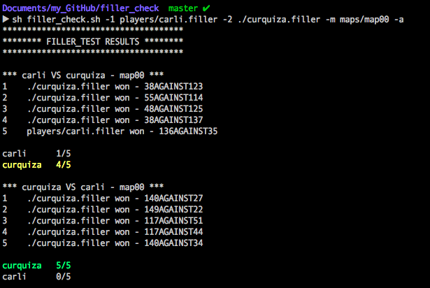
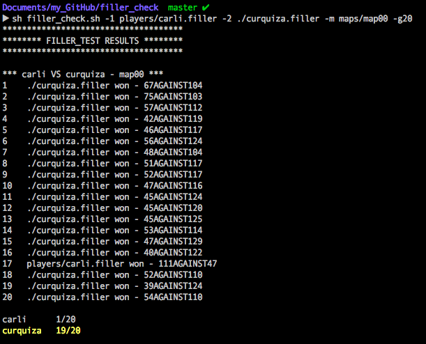

# filler_check

Easy checking of your Filler project, from 42 school. Enjoy ;)

## Launch the correction

```
sh correction.sh -b [your_binary_path] [ -r ]
```
Default behaviour : you are the player 1 <br>
`-r` : you are the player 2

#### Don't you trust the script ?
All the games traces are saved in the folder `trace/` created and filled during the execution.


## Check your Filler's performance

```
sh filler_check.sh -1 [player] -2 [player] -m [map] [ -g [games_nb] -a ]
```
Default behaviour : 5 games are played, in the configuration (player 1 and player 2) you asked for.<br>
`-a` : both configurations (player 1 and player 2) are played.<br>
`-g [games_nb]` : number of games to play. Better to use with 100 or 1000 games to challenge your Filler.

#### Examples



#### A result that you don't understand ?
As for `correction.sh`, all the games traces are saved in the folder `trace/` created and filled during the execution.
